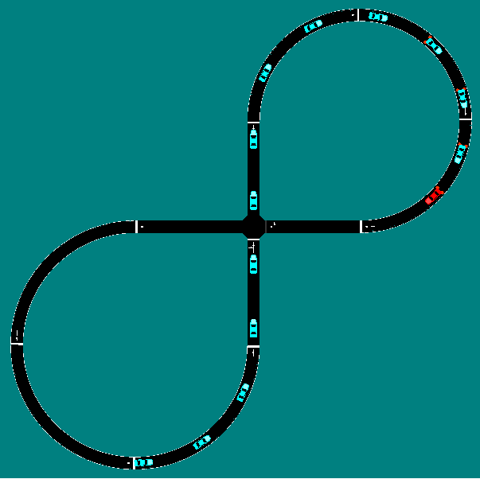
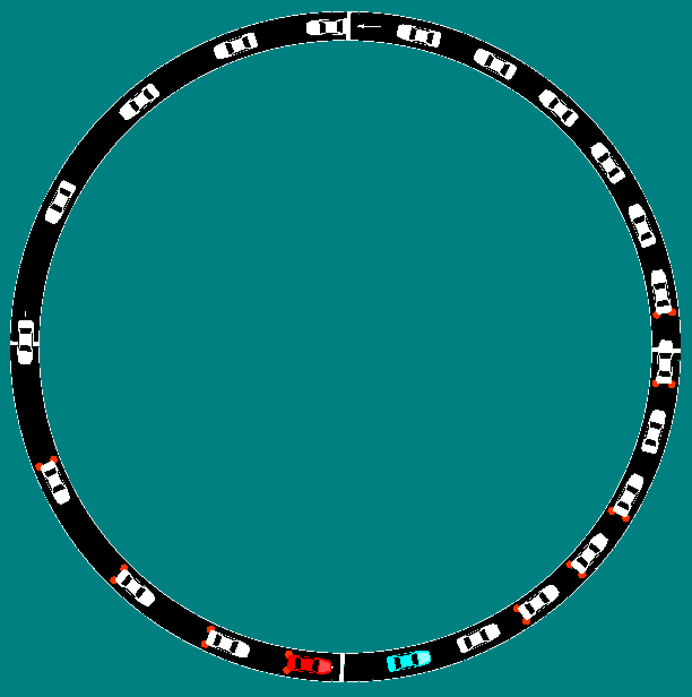
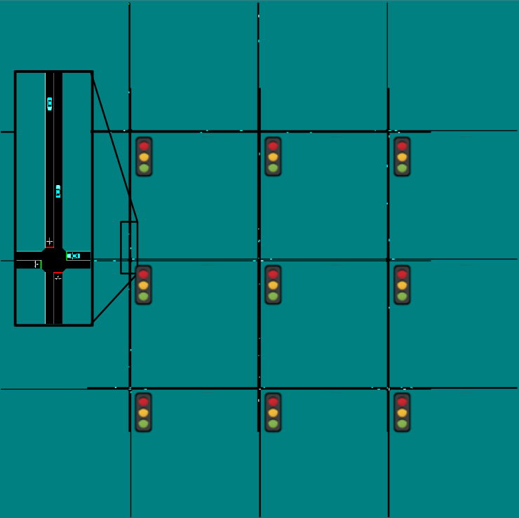
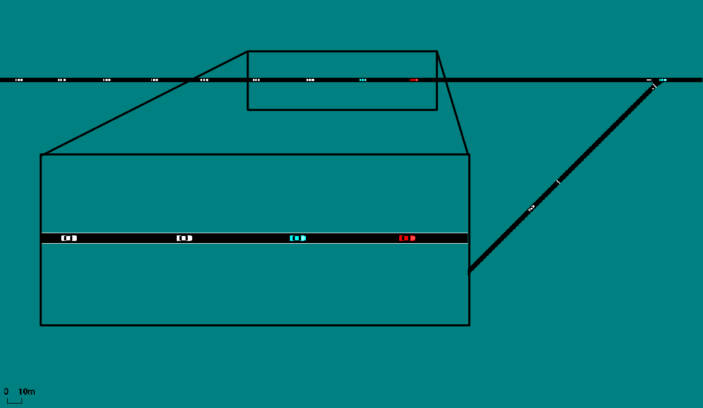

Built-in Traffic Networks
=========================

We provide a quick introduction to the traffic examples and tools that Flow comes pre-built with.
For further details, please examine the documentation provided in the examples folder.
A few points of clarification:

* We discuss the "goal" of the example. By this we mean the standard reward that is built into the environment. It is simple to change the reward function if other goals are desired.

* Occasionally we describe environments as *fully observed*. By this we mean that all relevant pieces of information (speed, relative positions, traffic light states) of the system are available to the controller. *Partially observed* refers to only a subset being available. This is the default configuration of the environment and the set of observations can be customized.

* Each environment has customizable environment/network parameters that can be used to configure it beyond what is described here. Particularly pertinent parameters are described. Additional parameters can be found by examining the documentation in the relevant network and environment files.

* In the figures below, the following key is used for vehicle colors, where AV stands for autonomous vehicle.

.. image:: ../img/key.png
   :width: 200
   :align: center

Figure Eight
------------
The figure-eight is a closed-ring version of an intersection. The goal is to maximize
the system-wide velocity for fourteen vehicles,
which necessitates spacing the vehicles so that they don't
run into conflicts at the merging points. The network is fully observed: all vehicles
speeds and positions are visible to the controller.
This network is also a benchmark, and has been
extensively tested at three penetration rates: 1 AV 13 humans, 7 AVs 7 humans, 14 AVs.

The network, pictured below,
is relatively light-weight and can be trained the quickest. It can serve both as a test
that the training process is working correctly and as a study of the difficulty of controlling
many vehicles simultaneously.

Stabilizing the Ring
--------------------
This example builds on the famous spontaneously forming shockwave from Sugiyama (2008).
In this scenario, human drivers placed on a ring develop a travelling wave that causes
decelerations and lowers the average velocity of the system. The goal is to train a single
autonomous vehicle to eliminate the shockwave.

The experiment config for this in human-only mode (non-RL) is `examples/exp_configs/non_rl/ring.py`.
The experiment config for RL-based is `examples/exp_configs/rl/singleagent/singleagent_ring.py`. 
These control environments are partially observed: the autonomous vehicle only observes its own 
distance to the leading vehicle, its speed, and the speed of the leading vehicle.

To make this task more difficult, the environment has a configurable parameter, `ring_length`, which
can be set to a list containing the minimum and maximum ring-size. The autonomous vehicle must
learn to distinguish these networks from each other and pick the appropriate driving behavior.

Controlling Traffic Lights
--------------------------
Flow comes with a New York City style, configurable grid of traffic lights where you can
control both the traffic lights and the autonomous vehicles. The build-in reward is to minimize
the total system delay. The number of rows and columns can be adjusted by changing the values in
`N_ROWS` and `N_COLUMNS` and the inflows adjusted by changing `EDGE_INFLOW`. Relevant files are
`traffic_light_grid.py` in the examples folder and `grid_0.py` and `grid_1.py` in the benchmark folder.

Avoiding Capacity Drop
--------------------------
This environment is a toy model of the bay-bridge which exhibits the phenomenon of *capacity drop*,
where increasing inflows leads to progressively decreasing outflows. The goal here is to maximize
the outflow, which can be done by carefully regulating the inflow. Key configurable parameters
here are `INFLOW`, which is self explanatory, and
`SCALING`, which controls the number of lanes: `SCALING=1` leads to 4 lanes, `SCALING=2`
to eight and so on.

.. image:: ../img/bottleneck-corl2018.png
   :width: 800
   :align: center

Stabilizing On-Ramp Merge
--------------------------
This environment consists of an on-ramp merge where a vehicle aggressively merging onto
the main-highway leads to a shockwave that slows down the system. The goal is to
*maximize the system velocity*. The key parameter here is `EXP_NUM` which controls the
AV penetration rate.

