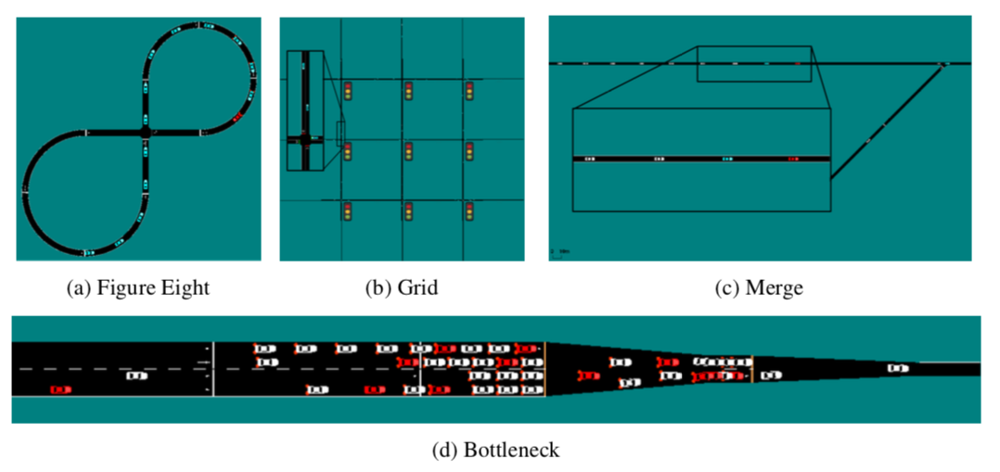

Regression Testing in Flow
==========================

To ensure that the four benchmarks created in Flow have consistently stable results,
we have created a set of regression tests for them. The four benchmarks are shown below:

To confirm that the improvement of the benchmarks via control of the autonomous vehicles
is to the expected level, we have provided scripts for training all of the benchmarks
and then visualizing the results and confirming that they are within the expected bounds.

To run the benchmark scripts, run

::

    flow/benchmarks/run_all_benchmarks.sh

**WARNING: This will spin up 11 c4.4xlarge AWS EC2 instances**.
Note, to do this you must have set up an AWS EC2 account.

Once the benchmarks are done training, pull the results down to a folder on your local machine
and then run

::

    flow/benchmarks/create_movies.sh <PATH TO TRAINING RESULTS>

This will create movies of all of the trained benchmarks and confirm that they results
are within 95% of the expected improvements in velocity or outflow.

Finally, to cite the benchmarks in your own work please reference:
Vinitsky, E., Kreidieh, A., Le Flem, L., Kheterpal, N., Jang, K., Wu, F., ... & Bayen, A. M. (2018, October).
Benchmarks for reinforcement learning in mixed-autonomy traffic. In Conference on Robot Learning (pp. 399-409).