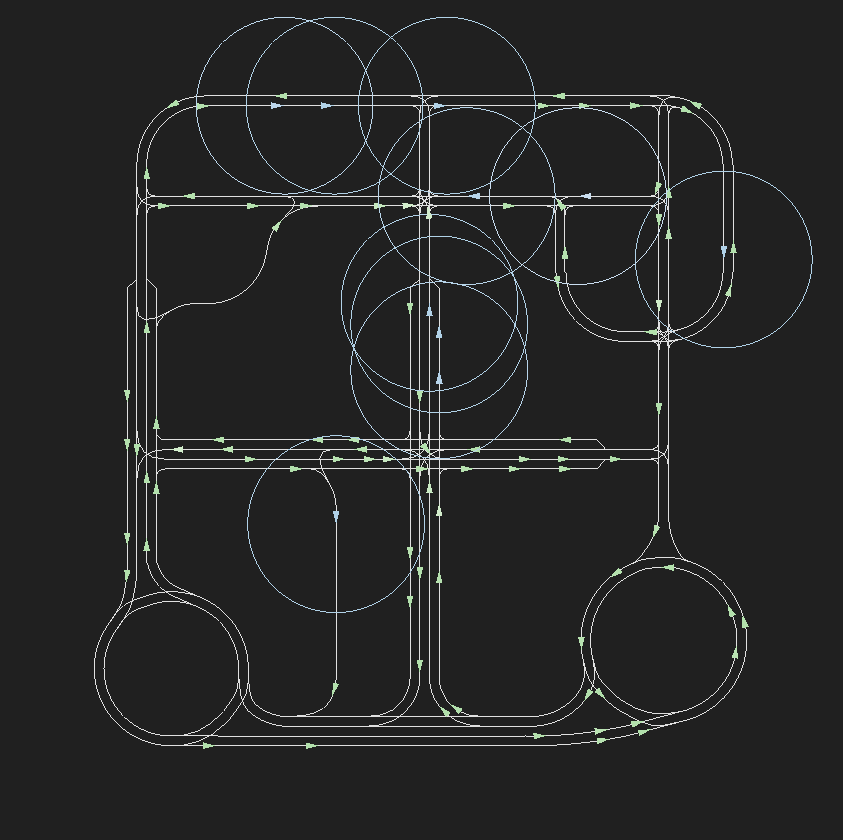
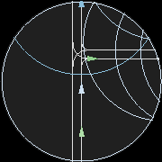
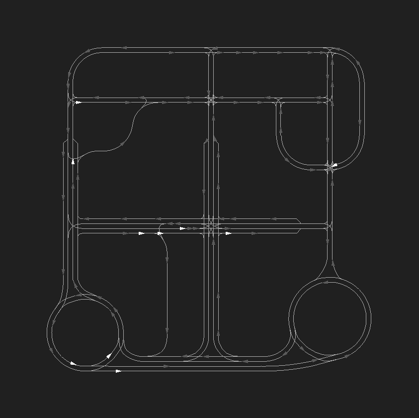
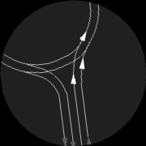

Flow Renderer
*******************

Flow has a customized renderer built on pyglet.  It provides a convenient
interface for image-based learning. It supports rendering the simulation as a
top-view snapshot and can extract local observations of RL vehicles or
tracked human vehicles.

An example of the minicity rendered by the pyglet renderer can found below.

The green arrows are untracked human vehicles, while the blue arrows are RL
vehicles and tracked human vehicles. Color saturation is proportional to
speed. For example, the greener the human vehicles, the faster they are driving.
The observation radius of RL and tracked human vehicles are marked by circles.

An example of an extracted local observation is as follows.

To generate the rendering seen above, use
::
    exp = minicity_example(render='drgb',  # Render in dynamic RGB colors
                           save_render=False,  # Disable saving
                           sight_radius=30,  # Radius of obs.
                           pxpm=3,  # Render at 3 pixel per meter
                           show_radius=True)  # Show obs. radius

To render in grayscale without observation circles, which is usually desired for
learning, use
::
   exp = minicity_example(render='gray',  # Render in grayscale
                          save_render=False,  # Disable saving
                          sight_radius=30,  # Radius of obs.
                          pxpm=3,  # Render at 3 pixel per meter
                          show_radius=False)  # Hide obs. radius

An example of a frame rendered in grayscale without circles is as follows.

An extracted location observation is presented below.

To save the rendering, set ``save_render=True``. The rendered frames and local
observations will be saved at ``~/flow_rendering``.

Finally, to compile the rendered frames into a video, install ``ffmpeg`` and run
::
    ffmpeg -i "~/flow_rendering/path_to/frame_%06d.png" -pix_fmt yuv420p -vf "pad=ceil(iw/2)*2:ceil(ih/2)*2" replay.mp4

For more information, check the
`PygletRenderer <https://github.com/flow-project/flow/blob/master/flow/renderer/pyglet_renderer.py>`_ class.

*The custom renderer is slower than SUMO's built-in GUI. We are working on
performance optimization and will update a faster version in near future.*
