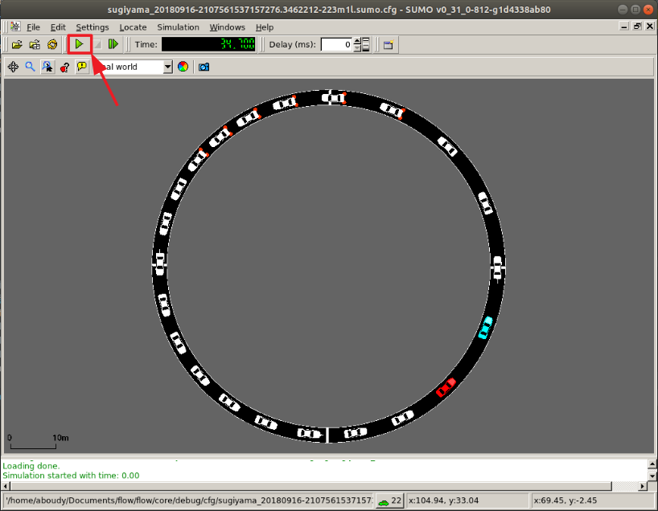
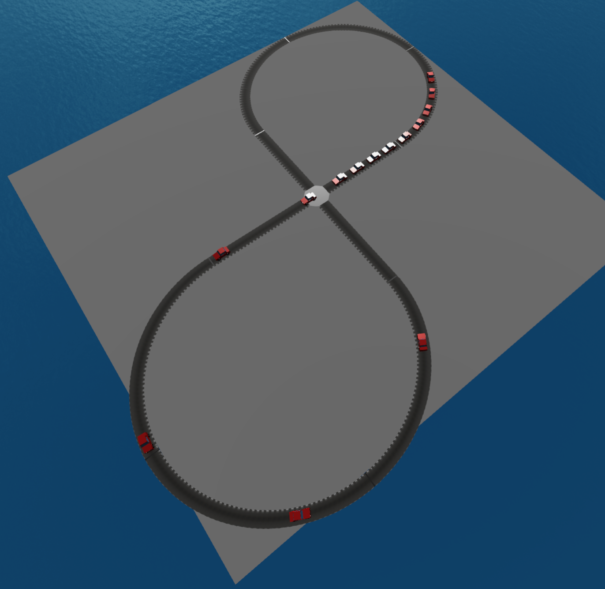

Visualization
*******************

Flow supports visualization of RLlib and SUMO computational experiments.
When using one of the below visualizers, a window will appear similar to the
one in the figure below. Click on the play button (highlighted in red) and the
simulation will begin, with the autonomous vehicles exhibiting the behavior
trained by the reinforcement learning algorithm.

RLlib
=====
Call the RLlib visualizer with
::

    python ./visualizer_rllib.py /ray_results/result_dir 1

The first command-line argument corresponds to the directory containing 
experiment results (usually within RLlib's ``ray_results``). The second is 
the checkpoint number, corresponding to the iteration number you wish to 
visualize. 

Parameter storage
-----------------
RLlib doesn't automatically store all parameters needed for restoring the 
state of a Flow experiment upon visualization. As such, Flow experiments in RLlib
include code to store relevant parameters. Include the following code snippet in
RLlib experiments you will need to visualize
::

    # Logging out flow_params to ray's experiment result folder
    from flow.utils.rllib import FlowParamsEncoder
    flow_json = json.dumps(
        flow_params, cls=FlowParamsEncoder, sort_keys=True, indent=4)
    config['env_config']['flow_params'] = flow_json
    config['env_config']['run'] = alg_run

This saves the relevant flow parameters to recreate Flow and perform
a rollout.

Another thing to keep in mind is that Flow parameters in RLlib experiments
should be defined **outside** of the ``make_create_env`` function. This allows
that environment creator function to use other experiment parameters later,
upon visualization. 

Using Sumo-Web3d to visualize
=============================
There are two options to create slightly fancy visualizations that look like

First, go to `Sumo-Web3d <https://github.com/flow-project/sumo-web3d>`_ and
follow the installation instructions.

Then, if you don't need any RL, from the sumo-web3d folder run

::

   python sumo_web3d/sumo_web3d.py "path to sumo.cfg"

If you want to visualize the result of an RL experiment use the rllib
visualization instructions given above with the additional flag
`--sumo_web3d`

::

   python ./visualizer_rllib.py /result_dir/itr_XXX.pkl --sumo-web3d

Then, either from the terminal logs pick out the printed port that has
num-clients = 2 or you can run

::

   ps aux | grep sumo

It will print out the ports running SUMO; you can then pick out the port number
with 2 clients. For example, it may look something like

::

   eugenevinitsky   54189   0.0  0.1  4360720  11208   ??  Ss
   5:33PM   0:00.04 sumo -c <PATH-TO-CFG.sumo.cfg>
   --remote-port 61057 --num-clients 2 --step-length 0.1
   --no-step-log --emission-output --time-to-teleport -1

Here you would pick out 61057 and then run

::

   python sumo_web3d/sumo_web3d.py --sumo-port "port-num" -c "path to sumo.cfg"

where "port_num" is the port indicated above, 61057.
